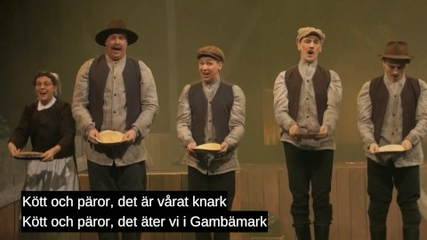
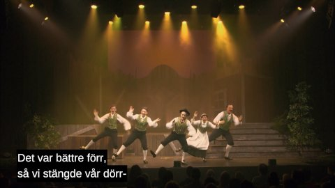
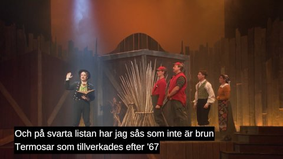

# Undertexter för Gambämark

Gambämark är en musikal av finlandssvenska humorgruppen KAJ. Den brukade gå att
köpa på https://vimeo.com/ondemand/gambamark/321211810, men verkar tyvärr ha
försvunnit nu. Kanske den kommer upp igen i framtiden?

Den här gitten innehåller undertexter för Gambämark i WebVTT-format. Jag har
försökt att följa Medietextarnas riktlinjer så gott jag kan.

## Bidra med förbättringar

Det är inte alltid lätt -- speciellt som skåning -- att förstå vad som sägs, men
jag har gjort mitt bästa. Där jag inte alls förstår, eller är väldigt osäker,
har jag skrivit "???".

Förbättringsförslag är välkomna, helst via en issue eller pull request i repot
på GitHub (https://github.com/dolkow/gambamark-subtitles).

Om du inte har ett konto så går det även bra att skicka in förslag via email
till gambamark@dolkow.se. Var isåfall tydlig med vilket namn och email-adress
du vill ska stå som källa. Det går bra att vara anonym.

För alla inkomna bidrag gäller licensen enligt nedan.

## Licens

Undertexterna är licensierade under Creative Commons BY 4.0:
https://creativecommons.org/licenses/by/4.0/

Det betyder att man får använda dem ganska fritt, så länge man namnger de som
skapade dem. Detta görs bäst genom att behålla eller kopiera erkännandet som
ligger i slutet av eftertexterna.

Denna licens gäller _särskilt_ för SVT -- kom igen, köp in och visa Gambämark!!

Manus och inspelningar av Gambämark tillhör KAJ och deras samarbetspartners.
Det är alltså förmodligen inte legitimt att t.ex. ta dessa undertexter och göra
en egen musikal utifrån dem. Gör inte det.

# Subtitles for Gambämark

Gambämark is a musical by the Finland-Swedish comedy group KAJ. You used to be
able to buy it at https://vimeo.com/ondemand/gambamark/321211810, but it appears
that it's no longer available. Maybe it will be again in the future?

This git contains subtitles for Gambämark in WebVTT format.

## Contributions

Even if you don't speak Swedish, you can help by pointing out spelling errors or
improper grammar, as well as improve my use of English idioms.

The easiest way is to create an issue here on GitHub. You can also send me an
email at gambamark@dolkow.se.

All contributions are subject to the license below.

## License

The subtitles are license under Creative Commons BY 4.0:
https://creativecommons.org/licenses/by/4.0/

That means you can use them pretty freely, as long as you give attribution to
the one who made them. The easiest way to do this is to keep or copy the
attribution that are already present at the end of the subtitles.

The script and recordings of Gambämark belong to KAJ and their partners. It's
probably not legal to do something dumb like taking these subtitles and making
your own musical based on them. Don't do that.
